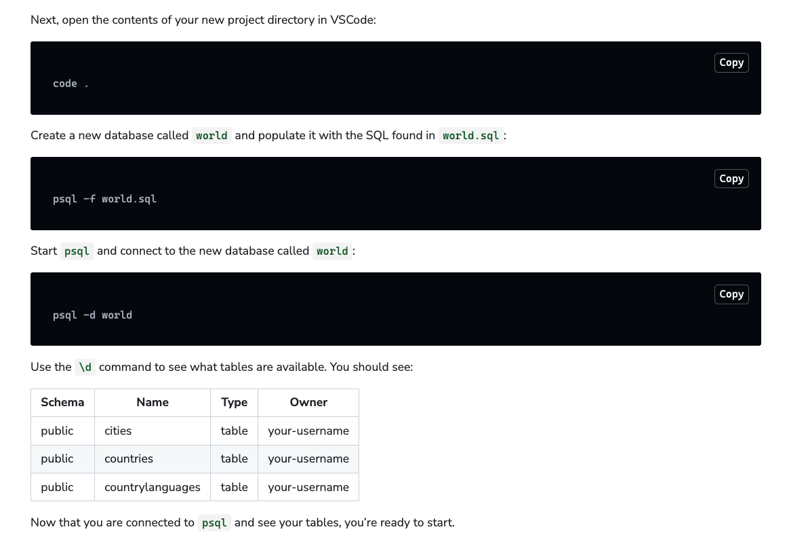
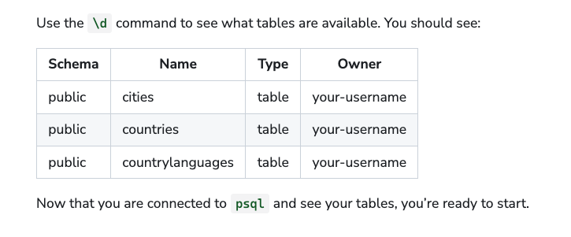

# Intro to SQL Lab

### About
We’re going to use what we’ve learned already about searching with SQL commands, and apply it to chase down and capture an elusive and World-renowned thief, Carmen Sandiego. Follow the clues to figure out where Carmen’s headed, so we can catch her and bring her in.

### Instructions
- Solve each clue in the clues.sql file in your starter code repo.
- Run the SQL file in the terminal as you solve each clue:
- psql -f clues.sql

### Addtl Info from set up after file is set up & VS code is opened:

